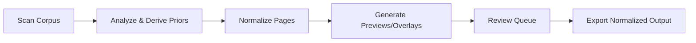
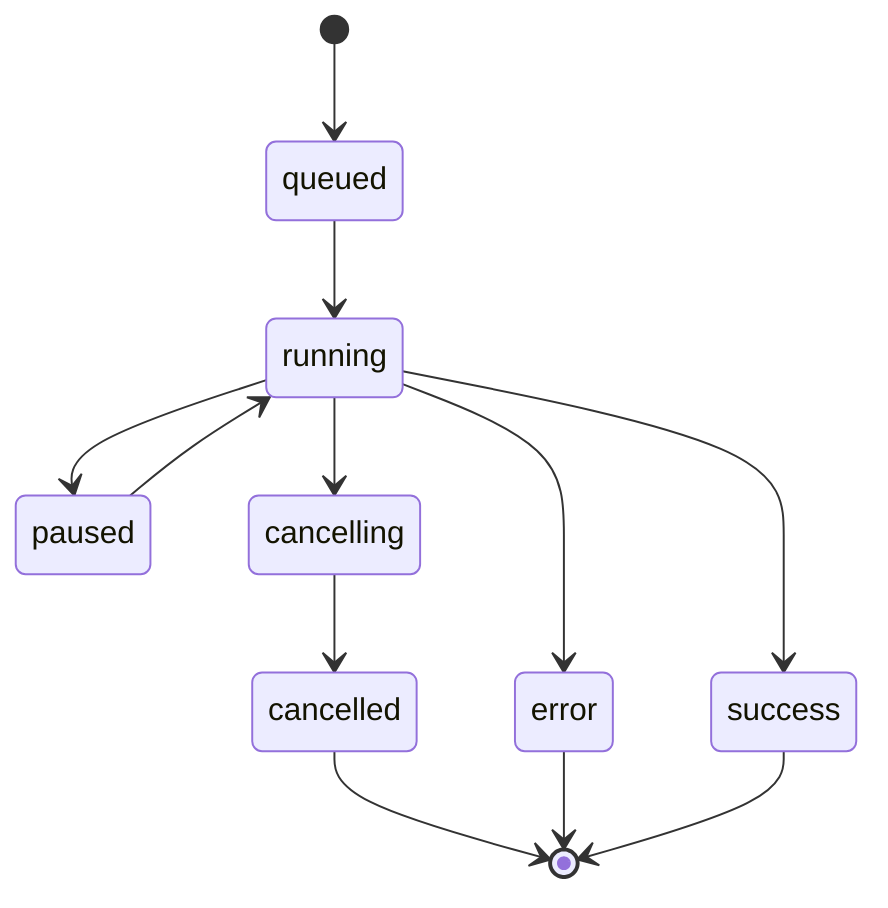

# Asteria Studio

Enterprise-grade, offline-first desktop app to normalize scanned pages (deskew, dewarp, crop, layout harmonization) with confidence-scored element detection and designer-friendly QA.



## Current Status

**Active Development** — Core pipeline, UI shell, and testing infrastructure implemented.

- ✅ **Electron + React desktop app** with keyboard-first navigation and accessibility
- ✅ **IPC bridge** with secure contextIsolation and typed contracts
- ✅ **Pipeline runner** with normalization, spread detection, and book priors
- ✅ **Review queue** with keyboard shortcuts (J/K navigation, A/F/R triage)
- ✅ **Comprehensive test suite** (190 tests across 31 files, ~92% coverage)
- ✅ **Command palette** (Ctrl/Cmd+K) for all actions
- ✅ **Theme support** (light/dark with system preference detection)
- ✅ **Performance optimizations** (virtualized review queue list)
- ✅ **Worker offload** (review queue sorting in a web worker)
- ✅ **Schema-compliant sidecars** (full element sets for every page)
- 🚧 **Rust CV core** (native skew + layout utilities integrated; full CV stages pending)
- ✅ **Packaging** (Electron Builder configuration added)
- 🚧 **Remote inference** (layout detection scaffolded via HTTP endpoint)

## Stack

- **UI**: Electron 40.1 + React 19.2 + Vite 7.3 + TypeScript 5.9
- **Testing**: Vitest 4 (unit/integration) + Playwright 1.58 (E2E) + Testing Library
- **Image Processing**: Sharp 0.34 (TypeScript), OpenCV (planned Rust)
- **Pipeline**: Node orchestrator with async queue and recovery
- **Native**: Rust + N-API bindings (via `napi-rs`, projection + dHash utilities integrated)
- **Runtime**: Node 24 LTS + pnpm 10.28 (see `.node-version`)

## Project Structure

```text
asteria-studio/
├── apps/asteria-desktop/          # Electron desktop application
│   ├── src/
│   │   ├── main/                  # Node main process
│   │   │   ├── main.ts            # App entry, window creation
│   │   │   ├── ipc.ts             # IPC handlers (scanCorpus, runPipeline, etc.)
│   │   │   ├── pipeline-runner.ts # Orchestrator: scan → analyze → normalize → export
│   │   │   ├── normalization.ts   # Scale, crop, metrics, preview generation
│   │   │   └── book-priors.ts     # Derive median trim/content boxes from samples
│   │   ├── preload/               # Secure IPC bridge (contextIsolation: true)
│   │   ├── renderer/              # React UI (Navigation, ReviewQueue, etc.)
│   │   └── ipc/                   # Shared contracts and validation
│   ├── scripts/                   # CLI tools (run-pipeline, export-normalized)
│   ├── e2e/                       # Playwright E2E tests
│   └── pipeline-results/          # Generated artifacts (gitignored)
├── packages/
│   ├── pipeline-core/             # Rust CV/ML bindings (N-API, in progress)
│   └── ui-kit/                    # Shared React components (planned)
├── docs/                          # Architecture, product brief, UX, model strategy
├── spec/                          # JSON schema + YAML config defaults
└── projects/                      # Local corpus storage (input, work, output)
```

## Quick Start

### Bootstrap

```bash
pnpm bootstrap
```

Expected output (abridged):

```text
========================================================================
ASTERIA BOOTSTRAP
========================================================================
Installing dependencies (pnpm install)
...
Checking Rust toolchain (optional)
rustc: <version>     # or "Rust toolchain not found. This is optional for now."
```

### First Run

```bash
pnpm dev
```

Expected output (abridged):

```text
VITE v7.x  ready in ...
Local:   http://localhost:5173/
```

Then an Electron window should open with the Asteria Studio shell.

### Development Commands

```bash
# Use Node 24 LTS (see .node-version) + pnpm 10.28

# Start dev server (renderer + main process)
pnpm dev

# Run unit tests with coverage
pnpm test

# Run E2E tests
pnpm test:e2e

# Type checking
pnpm typecheck

# Format check
pnpm format

# Format write
pnpm format:write

# Build production assets + launcher
pnpm build

# Verify build artefacts
pnpm build:verify

# Run built app (macOS/Linux)
apps/asteria-desktop/dist/asteria-studio

# Package distributables
pnpm package

# Verify packaged artefacts (checks for native modules like sharp)
pnpm package:verify

# Package + verify in one go
pnpm package:full
```

### CI Helpers

```bash
# Local CI-style quality gate (format, lint, typecheck, build, coverage)
pnpm ci:quality

# E2E smoke tests
pnpm ci:e2e

# Build + package + verify
pnpm ci:desktop
```

### Runbook: Quality & Test Gates

Use this checklist before merging changes:

1. **Quality gate**: `pnpm ci:quality` (format check, lint, typecheck, build, coverage).
2. **E2E smoke** (when UI changes land): `pnpm ci:e2e`.
3. **Desktop packaging** (release candidates): `pnpm ci:desktop`.
4. **Regression spot-checks**: Open Review Queue and verify overlays + shortcuts.

### Pipeline Evaluation

```bash
# Run pipeline on sample corpus (normalize 300 pages)
pnpm pipeline:run projects/mind-myth-and-magick 300

# Export normalized outputs only (no priors or full analysis)
pnpm pipeline:export projects/mind-myth-and-magick 50
```

Results written to `apps/asteria-desktop/pipeline-results/` with:

- `normalized/` — processed images
- `previews/` — low-res thumbnails
- `overlays/` — annotated visualization
- `sidecars/` — JSON layout metadata
- `priors-sample/` — book model from first N pages

### Configuration (.env)

Copy `.env.example` to `.env` to set local overrides. The app loads `.env` and `.env.local`
from the repo root on startup and in CLI scripts.

Common settings:

- `ASTERIA_OUTPUT_DIR` — override pipeline results directory
- `ASTERIA_PIPELINE_CONFIG_PATH` — override `spec/pipeline_config.yaml`
- `ASTERIA_NORMALIZE_CONCURRENCY` — tune normalization parallelism
- `ASTERIA_REMOTE_LAYOUT_ENDPOINT` — optional remote layout inference URL
- `ASTERIA_REMOTE_LAYOUT_TOKEN` — optional auth token for remote inference
- `ASTERIA_REMOTE_LAYOUT_TIMEOUT_MS` — request timeout in milliseconds

### Rust (Optional)

Rust is only required if you are actively developing the native CV core in
`packages/pipeline-core`. If Rust is not installed, the pipeline continues using the
TypeScript + Sharp implementation and reports `rustModuleVersion: "unknown"` in run manifests.
Remote inference (if configured) still works without Rust.

### VS Code Tasks

Common tasks are available in `.vscode/tasks.json`:

- `Asteria: Dev`
- `Asteria: Test`
- `Asteria: Golden (test)`
- `Asteria: Pipeline (run)`

### Git Hooks

Enable the repo hooks once per clone:

```bash
git config core.hooksPath .githooks
```

Or:

```bash
pnpm hooks:setup
```

The pre-commit hook runs `pnpm format`, `pnpm lint`, and `pnpm typecheck` to catch
issues before CI.

## Documentation

- [Architecture](docs/architecture.md) — System design, data flow, tech stack
- [Product Brief](docs/product_brief.md) — Vision, capabilities, success criteria
- [UI/UX](docs/ui_ux.md) — Screens, interactions, keyboard shortcuts, accessibility
- [Model Strategy](docs/model_strategy.md) — CV/ML approach, deskew, dewarp, layout detection

## Key Features

### Keyboard-First UX

- **Navigation**: `Ctrl+1–6` to switch screens
- **Command Palette**: `Ctrl+K` for global actions
- **Review Queue**: `J/K` navigation, `A/F/R` triage, `Space` overlay toggle
- **Review Submission**: `Ctrl+Enter` submits review decisions via IPC
- **Accessibility**: Full keyboard support, WCAG 2.2 Level AA, focus indicators

### Pipeline Stages

1. **Corpus Scan** — Discover pages, compute checksums, detect duplicates
2. **Analysis** — Derive target dimensions, aspect ratios, quality signals
3. **Spread Split** — Detect two-page scans, split at gutter (confidence gating)
4. **Book Priors** — Sample first N pages for median trim/content boxes
5. **Normalization** — Scale, crop, align to target DPI and dimensions
6. **QA Outputs** — Generate previews, overlays, JSON sidecars for review



### Safety & Determinism

- **Checksums** — SHA-256 for inputs, detect duplicates and changes
- **Perceptual hashes** — dHash for normalized outputs (native-accelerated when available)
- **Native layout hints** — Heuristic layout elements when remote inference is unavailable
- **Manifests** — Per-run config, metrics, decisions versioned in JSON
- **Recovery** — Pipeline resumes from last checkpoint on failure
- **Validation** — IPC inputs validated with Zod-like schemas before execution

## Testing

- **Unit/Integration**: 190 tests, ~92% coverage (Vitest + jsdom)
- **E2E**: Playwright smoke tests for critical workflows
- **Coverage Thresholds**: 80% lines/statements, 75% branches, 80% functions
- **Accessibility**: Testing Library queries with `getByRole`, keyboard event simulation

## Next Milestones

1. **Rust CV Core** — Wire N-API bindings for deskew, dewarp, layout detection
2. **Packaging** — Electron Builder config for Mac/Win/Linux distributable
3. **Sidecar Emission** — Schema-compliant JSON sidecars with full element sets (done)
4. **Performance** — Review queue worker + virtualization (done); add web workers for previews
5. **Remote Models** — Optional inference endpoint with local fallback
   - Config keys: `models.endpoints.remote_layout_endpoint`, `remote_layout_token_env`, `remote_layout_timeout_ms`

## License

See [LICENSE](LICENSE) for details.
