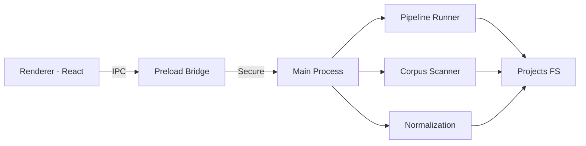
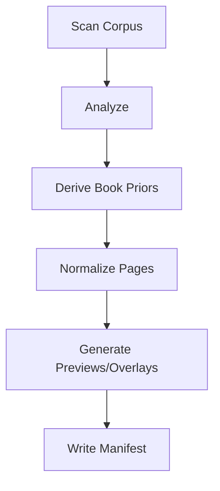

# Asteria Studio Desktop

Electron + React desktop application for Asteria Studio. Provides keyboard-first UI, secure IPC bridge, and pipeline orchestration.



## Architecture

### Process Separation

**Renderer Process** (Chromium + React):

- UI components, navigation, review queue
- No direct Node.js access (contextIsolation: true)
- Communicates via `window.asteria.ipc` API

**Main Process** (Node.js):

- IPC handlers, pipeline orchestration
- File system access, image processing (Sharp)
- Future: Native Rust module loading (N-API)

**Preload Script**:

- Secure bridge using `contextBridge`
- Exposes typed IPC API to renderer
- Validates all messages before forwarding

## Project Structure

```text
src/
├── main/                      # Node main process
│   ├── main.ts                # App entry, window creation, IPC registration
│   ├── ipc.ts                 # IPC handlers (scanCorpus, runPipeline, etc.)
│   ├── pipeline-runner.ts     # Pipeline orchestrator with recovery
│   ├── normalization.ts       # Scale, crop, metrics, preview generation
│   ├── book-priors.ts         # Derive median trim/content boxes from samples
│   └── pipeline-core-native.ts # Rust N-API loader (planned)
├── preload/
│   └── index.ts               # Secure IPC bridge (contextBridge)
├── renderer/                  # React UI
│   ├── App.tsx                # Main app with navigation and command palette
│   ├── components/            # Reusable components (Navigation, CommandPalette)
│   ├── screens/               # Screen components (Projects, ReviewQueue, etc.)
│   ├── hooks/                 # React hooks (useTheme, useKeyboardShortcut)
│   └── theme/                 # Design tokens, CSS variables
└── ipc/                       # Shared contracts
    ├── contracts.ts           # TypeScript types for IPC messages
    ├── validation.ts          # Input validation schemas
    ├── corpusScanner.ts       # Corpus discovery and checksums
    └── corpusAnalysis.ts      # Dimension calculation, quality metrics
```

## Development

### Prerequisites

- Node.js 18+
- pnpm 8+
- macOS, Windows, or Linux

### Commands

```bash
# Install dependencies
pnpm install

# Start dev server (renderer + main process)
pnpm dev

# Build for production
pnpm build

# Package app (electron-builder)
pnpm package

# Create distributables without publishing
pnpm dist

# Type checking
pnpm typecheck

# Linting
pnpm lint

# Unit tests with coverage
pnpm test

# UI tests only (renderer components)
pnpm test:ui

# E2E tests (Playwright)
pnpm test:e2e

# Pipeline evaluation (CLI)
pnpm pipeline:run <projectRoot> [sampleCount]
pnpm pipeline:export <projectRoot> [count]
```

### Development Workflow

1. **Renderer changes**: Auto-reload in browser via Vite HMR
2. **Main process changes**: Requires restart (Ctrl+C, `pnpm dev` again)
3. **IPC contract changes**: Update `src/ipc/contracts.ts`, restart main process
4. **Test changes**: Run `pnpm test` or `pnpm test:ui` for fast feedback

## Testing

### Test Suite

- **91 tests** across 16 files
- **89% coverage** (88.61% statements, 75% branches, 82.74% functions, 89.17% lines)
- **Vitest** for unit/integration, **Playwright** for E2E
- **Testing Library** for accessible component testing

### Test Categories

1. **IPC Contracts** (`src/ipc/*.test.ts`):
   - Channel validation, type safety
   - Input sanitization

2. **Corpus Operations**:
   - Scanner: File discovery, checksums, duplicates
   - Analyzer: Dimension calculation, aspect ratio

3. **Pipeline**:
   - Normalization: Scale/crop, metrics, previews
   - Book Priors: Median computation, outlier detection
   - Runner: End-to-end flow, recovery, manifest generation

4. **UI Components** (`src/renderer/*.test.tsx`):
   - Navigation: Keyboard shortcuts, accessibility
   - Review Queue: Triage workflow (J/K, A/F/R, Space)
   - Command Palette: Filtering, execution
   - Theme: Switching, persistence, system preference

### Coverage Thresholds

```json
{
  "lines": 80,
  "statements": 80,
  "branches": 75,
  "functions": 80
}
```

All thresholds currently met ✅

## IPC Architecture

### Channel Naming

All channels prefixed with `asteria:` for clarity:

- `asteria:scanCorpus`
- `asteria:analyzeCorpus`
- `asteria:runPipeline`
- `asteria:getBookModel`
- (more planned)

### Type Safety

```typescript
// Contracts (shared)
export interface ScanCorpusRequest {
  projectPath: string;
}

export interface ScanCorpusResponse {
  pages: PageData[];
  duplicates: string[];
  totalSize: number;
}

// Preload (exposes to renderer)
contextBridge.exposeInMainWorld("asteria", {
  ipc: {
    scanCorpus: (path: string) => ipcRenderer.invoke("asteria:scanCorpus", path),
  },
});

// Main (handles requests)
ipcMain.handle("asteria:scanCorpus", async (event, path: string) => {
  const result = await scanCorpus(path);
  return result;
});

// Renderer (calls)
const result = await window.asteria.ipc.scanCorpus("/path/to/project");
```

### Validation

All IPC inputs validated before execution:

- Path existence and type (file vs directory)
- Numeric ranges (DPI, dimensions, sample count)
- Enum values (unit types, layout profiles)
- Required vs optional fields

## Pipeline Runner

### Stages



1. **Scan**: Discover pages, compute checksums, detect duplicates
2. **Analyze**: Calculate target dimensions from DPI + physical size
3. **Priors**: Sample first N pages for median trim/content boxes
4. **Normalize**: Scale, crop, metrics for all pages
5. **Previews**: Generate thumbnails (320px) and overlays
6. **Manifest**: Write run metadata with config hash

### Recovery

Pipeline tracks progress and resumes from last checkpoint on failure:

- Checksum-based deduplication (skip already processed)
- Per-page error handling (continue on failure, collect errors)
- Final manifest includes success/failure counts

### CLI Tools

**Run Pipeline**:

```bash
pnpm pipeline:run projects/mind-myth-and-magick 300
```

**Export Normalized** (skip priors/analysis):

```bash
pnpm pipeline:export projects/mind-myth-and-magick 50
```

Results in `pipeline-results/` (gitignored):

- `normalized/` — Processed images
- `previews/` — 320px thumbnails
- `overlays/` — Annotated visualization
- `sidecars/` — JSON layout metadata (planned)
- `priors-sample/` — Book model from samples

## Keyboard Shortcuts

### Global Navigation

| Shortcut | Action               |
| -------- | -------------------- |
| `Ctrl+K` | Open command palette |
| `Ctrl+1` | Go to Projects       |
| `Ctrl+2` | Go to Run History    |
| `Ctrl+3` | Go to Live Monitor   |
| `Ctrl+4` | Go to Review Queue   |
| `Ctrl+5` | Go to Exports        |
| `Ctrl+6` | Go to Settings       |

### Review Queue

| Shortcut  | Action                         |
| --------- | ------------------------------ |
| `J` / `K` | Next/Previous page             |
| `A`       | Accept (green badge)           |
| `F`       | Flag for review (yellow badge) |
| `R`       | Reject (red badge)             |
| `U`       | Undo last decision             |
| `Space`   | Toggle overlay visibility      |

## Accessibility

- **WCAG 2.2 Level AA** compliant
- **Keyboard-only** navigation (no mouse required)
- **Focus indicators** (2px outline on `:focus-visible`)
- **Semantic HTML** (`<nav>`, `<button>`, `<main>`)
- **ARIA labels** for all interactive elements
- **Color contrast**: 4.5:1 for text, 3:1 for UI components
- **Theme support**: Light/dark with system preference detection

## Next Steps

### Near-Term

- ✅ Complete JSON sidecar emission (schema ready)
- ✅ Wire Rust N-API bindings for CV core
- ✅ Electron Builder packaging (Mac, Windows, Linux)
- ✅ Spread split integration into pipeline output

### Mid-Term

- 🎯 Layout detection with fine-tuned YOLO model
- 🎯 Overlay rendering with element annotations
- 🎯 Performance optimization (virtualized lists, web workers)
- 🎯 Settings screen with customizable shortcuts

### Long-Term

- 🌐 Remote model inference with local fallback
- 🤝 Multi-project workspace
- 🔌 Plugin system for custom detectors
- 📊 Advanced metrics dashboard
