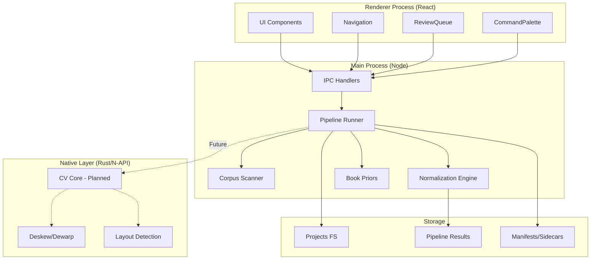
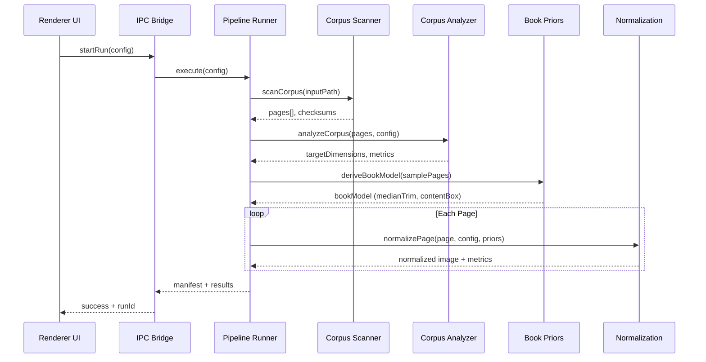
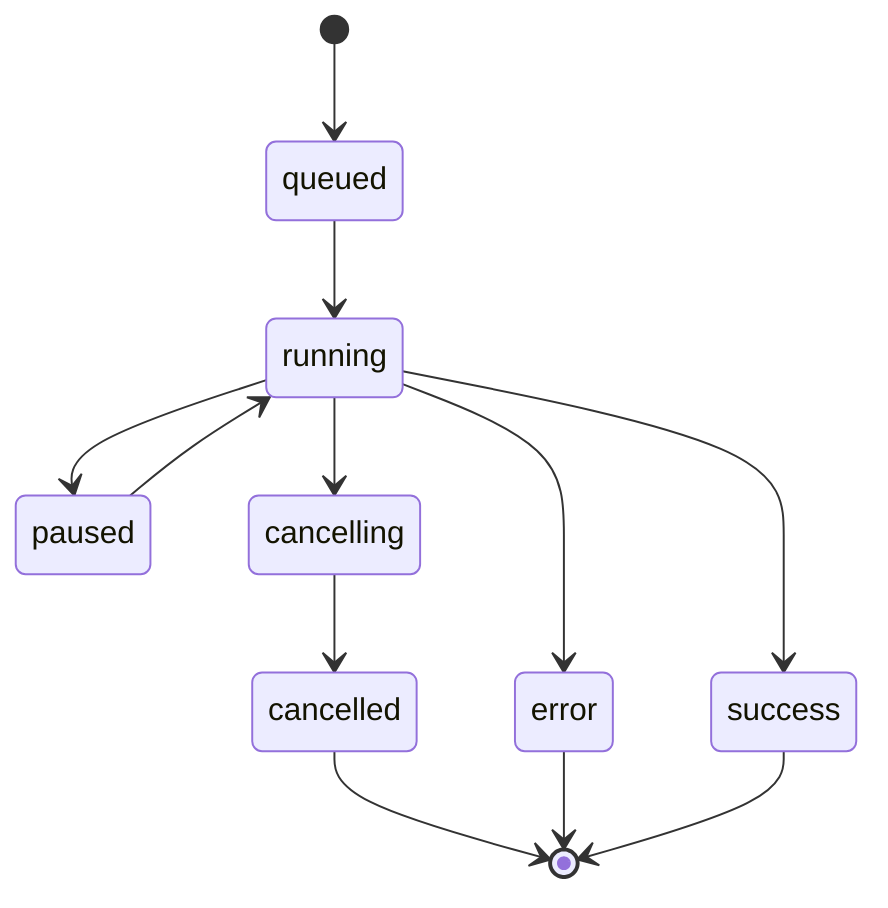
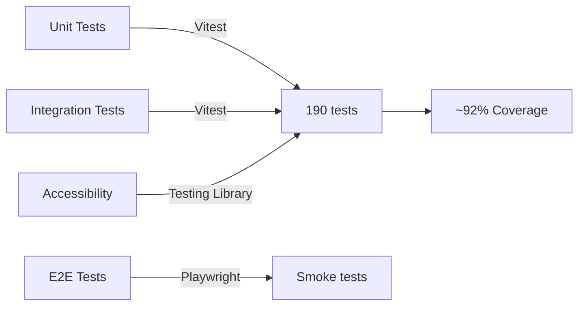

# Asteria Studio — Architecture

## Overview

Electron desktop app with React front end, Rust CV/ML core (in progress) exposed to Node via N-API, and a local job orchestrator. Offline-first, single-machine projects with optional remote accelerators for heavy inference. All outputs are versioned in a local project workspace.



## Major Components

### Implemented (✅)

- **UI Shell (Electron + React/Vite)**: Navigation, review queue, command palette, keyboard shortcuts, theme support, accessibility features
- **IPC Bridge (Preload)**: Secure contextIsolation with typed contracts; validation layer for all main ↔ renderer communication
- **Pipeline Orchestrator (Node)**: Schedules stages, manages manifests, tracks progress, implements recovery/resume logic
- **Corpus Scanner**: Discovers pages, computes checksums, detects duplicates, validates inputs
- **Normalization Engine**: Scale/crop to target DPI+dimensions, quality metrics, preview/overlay generation
- **Book Priors**: Samples first N pages to derive median trim/content boxes, applies to full corpus
- **Spread Split Detection**: Identifies two-page scans with confidence gating, splits at gutter
- **Project Store**: Filesystem-backed storage for inputs, intermediates, outputs, manifests, and sidecars
- **Sidecar Emission**: JSON sidecars conforming to `spec/page_layout_schema.json` with full element sets
- **Native Utilities**: Projection profiles + dHash integrated via N-API (performance assist)
- **Native Layout Heuristics**: Local layout element detection via N-API

### In Progress (🚧)

- **CV/ML Core (Rust)**: N-API bindings scaffolded; deskew, dewarp, layout detection implementations pending
- **Model Runner Abstraction**: Local ONNX/Tesseract backends planned; remote inference endpoint optional
- **Exporter**: Generates normalized PNGs, previews, overlays, and schema-compliant sidecars
- **Packaging**: Electron Builder configuration added (Mac/Win/Linux targets)
- **Remote Inference**: HTTP layout endpoint scaffolding with optional auth + timeout

## Data Flow (per batch)



### Pipeline Stages (Current Implementation)

1. **Ingest**: Register source images, derive page ordering, compute SHA-256 checksums, detect duplicates
2. **Analysis**: Compute target dimensions from user config (mm/inches + DPI), detect aspect ratios, quality signals
3. **Spread Split** (Optional): Detect two-page scans via center gutter analysis; split when confidence > threshold
4. **Book Priors** (Optional): Sample first N pages to derive median trim/content boxes, running heads, baseline grid
5. **Preprocess**: Generate previews, denoise/contrast hints, estimate orientation
6. **Deskew**: Estimate skew angle and gate low-confidence rotations
7. **Dewarp**: Record warp metrics (no-op until CV model is wired)
8. **Shading**: Estimate low-frequency illumination field and apply confidence-gated correction
9. **Layout Detection**: Infer layout profile and element counts for QA gating + manifests
10. **Normalization**:
   - Scale to target DPI
   - Crop with bleed/trim rules
   - Generate quality metrics (sharpness, contrast)
   - Create preview thumbnails (320px wide)
   - Create overlay annotations
11. **Export**: Write normalized PNGs, previews, overlays to `pipeline-results/runs/{runId}`; generate run-scoped manifest JSON

- Emit schema-compliant JSON sidecars per run in `pipeline-results/runs/{runId}/sidecars/`

### Wired Pipeline Stages (End-to-End)

The following stages are wired end-to-end in the pipeline runner today, meaning they are scheduled,
tracked in progress events, and persisted to the run manifest:

1. **Ingest** → **Analysis** → **Spread Split** (optional)
2. **Book Priors** (optional)
3. **Normalization**
4. **Export** (manifests, overlays, previews, sidecars)

Other stages (deskew, dewarp, shading, layout detection) are scaffolded with metrics and manifest
slots but gated or no-ops until their CV backends are wired.

### Per-Stage Metrics (Emitted Today)

Each stage emits counters and timing data into `report.json` and the run manifest:

- **Ingest**: `page_count`, `duplicate_count`, `checksum_time_ms`
- **Analysis**: `target_width_px`, `target_height_px`, `aspect_ratio_delta`
- **Spread Split**: `split_candidates`, `split_applied`, `avg_confidence`
- **Book Priors**: `sampled_pages`, `trim_box_median`, `content_box_median`
- **Normalization**: `avg_sharpness`, `avg_contrast`, `avg_file_size_bytes`, `throughput_pps`
- **Export**: `normalized_count`, `preview_count`, `overlay_count`, `sidecar_count`

Stages that are gated still emit a stub metric block with `skipped: true` for auditability.

### Run Manifest Fields (Core)

The run manifest captures configuration, artifacts, and stage metrics needed for replay:

- `run_id`, `project_id`, `created_at`, `status`
- `config_snapshot` (pipeline config + user overrides)
- `input` (source path, page count, checksum summary)
- `stages[]` (name, status, started_at, finished_at, metrics)
- `artifacts` (normalized/previews/overlays/sidecars paths + counts)
- `priors` (book model summary when available)
- `quality` (aggregate metrics + thresholds used)

### Planned Stages (Future)

1. **Dewarp (CV)**: Page contour detection + UNet-based surface estimation; full warp correction
2. **Layout Detection (ML)**: YOLOv8/PP-PicoDet fine-tuned detectors and OCR-aware refinement
3. **Shading Correct (Advanced)**: Learned illumination field + spine shadow model updates
4. **QA**: Produce overlays, thumbnails, and metrics for reviewer queue

## Projects & Storage

Current filesystem layout:

```text
projects/{projectId}/
├── project.json                # Project metadata + input path
├── pipeline.config.json        # Optional per-project overrides
├── input/
│   └── raw/                    # Optional local copy of source files
└── work/                       # Intermediate processing artifacts (future)

pipeline-results/               # Working directory (gitignored)
├── run-index.json              # Index of known runs (paths + counts)
└── runs/                        # Per-run artifacts
    └── {runId}/
        ├── normalized/          # Processed images at target DPI/dimensions
        ├── previews/            # 320px width thumbnails for UI
        ├── overlays/            # Annotated visualization (crop boxes, grids)
        ├── sidecars/            # JSON layout metadata (schema-compliant)
        ├── training/            # Review-derived training signal manifests
        ├── priors-sample/       # Book model from sampled pages
        ├── report.json          # Run report with config snapshot + metrics
        ├── review-queue.json    # Review queue for that run
        ├── manifest.json        # Run-scoped manifest
        └── exports/{timestamp}/ # Export bundles (per format + report + manifest)
```

### Run Lifecycle & Control

- **Statuses**: `queued` → `running` → `paused` (optional) → `cancelling` → `cancelled`/`error`/`success`
- **Pause/Resume**: pipeline stages check a pause gate between batches; resume continues from the
  current stage without restarting completed pages.
- **Cancel**: sets status to `cancelling`, aborts in-flight work, then persists `cancelled` in
  report/manifest snapshots for auditing.



### Live Monitor & Progress Events

Main process emits `asteria:run-progress` events (throttled to ~5–10Hz) to the renderer.
Events carry stage name, processed/total counts, and throughput for the Live Monitor screen.

### Debugging IPC

Common failure cases:

- **`window.asteria` is undefined**: preload did not load. Confirm `webPreferences.preload`
  points to `src/preload/index.ts` (built path) and that `contextIsolation` is enabled.
- **"No handler registered" / invoke errors**: `registerIpcHandlers()` may not be called or
  the channel name is misspelled. Verify the channel exists in `src/ipc/contracts.ts`.
- **"Request failed" with no details**: preload sanitizes errors; check the main process
  terminal output for the full stack trace.
- **Validation errors**: payloads fail schema guards in `src/ipc/validation.ts`. Compare
  the renderer payload shape with the contract type.
- **Hot-reload desync**: renderer refreshes but preload/main are stale. Restart `pnpm dev`
  or hard-reload the window.

Logging tips:

- In renderer devtools, run `window.asteria.ping()` to confirm the bridge is alive.
- Add temporary `console.log` statements in `src/main/ipc.ts` and `src/preload/index.ts`
  to trace channel flow.
- For deeper Electron logs, start dev with `ELECTRON_ENABLE_LOGGING=1` and
  `ELECTRON_ENABLE_STACK_DUMPING=1`.

### Manifest Structure

Each pipeline run generates a `manifest.json`:

```json
{
  "runId": "run-1704067200000",
  "status": "success",
  "exportedAt": "2026-02-02T10:30:00Z",
  "sourceRoot": "/path/to/project",
  "count": 783,
  "configSnapshot": {
    "resolved": {
      /* resolved pipeline config */
    },
    "sources": {
      /* config paths + overrides */
    }
  },
  "determinism": {
    "appVersion": "0.1.0",
    "configHash": "sha256...",
    "rustModuleVersion": "unknown",
    "modelHashes": [],
    "seed": "static"
  },
  "pages": [
    {
      "pageId": "page-001",
      "checksum": "sha256...",
      "dhash": "3fa82c9bd01e7a11",
      "normalizedFile": "page-001.png",
      "previews": ["page-001-source.png", "page-001-normalized.png"]
    }
  ]
}
```

### Storage Principles

- **Local-only**: No cloud dependencies; all data stays on machine
- **Checksums**: SHA-256 for inputs, detect changes and duplicates
- **Versioned runs**: Each execution creates new manifest with unique ID
- **Idempotent**: Same inputs + config = same outputs (future: with Rust determinism)
- **Resumable**: Pipeline tracks progress, can resume from last checkpoint (implemented)

## Pipelines & Stages

- **Configurable Stages**: Toggle/threshold per stage; stop-on-low-confidence rules
- **Parallelism**: Per-page async tasks with Promise.allSettled; sequential ordering when needed
- **Recovery**: Checkpoint tracking with resumable execution on failure
- **Determinism**: Manifests capture config hashes, checksums, and version; reproducible outputs (future: seeded RNG)

## Tech Stack

### Current Implementation

| Layer                | Technology            | Version | Purpose                                      |
| -------------------- | --------------------- | ------- | -------------------------------------------- |
| **Desktop Shell**    | Electron              | 40.1    | Cross-platform window management             |
| **UI Framework**     | React                 | 19.2    | Component-based renderer                     |
| **Build Tool**       | Vite                  | 7.3     | Fast dev server + bundling                   |
| **Language**         | TypeScript            | 5.9     | Type safety across codebase                  |
| **Runtime**          | Node.js (LTS)          | 24.13   | Main + tooling runtime                       |
| **Package Manager**  | pnpm                  | 10.28   | Workspace installs + lockfile                |
| **Image Processing** | Sharp                 | 0.34    | Resize, format conversion, metadata          |
| **Testing (Unit)**   | Vitest                | 4.0     | Fast test runner + coverage                  |
| **Testing (E2E)**    | Playwright            | 1.58    | Browser automation                           |
| **Testing (UI)**     | Testing Library       | 16.3    | Accessible component testing                 |
| **State**            | React hooks           | —       | Local component state (useState, useReducer) |
| **Theming**          | CSS Custom Properties | —       | Light/dark themes via localStorage           |

### Native Layer (In Progress)

| Component      | Technology   | Status           |
| -------------- | ------------ | ---------------- |
| **Bindings**   | `napi-rs`    | Scaffolded       |
| **CV Library** | OpenCV       | Planned          |
| **ML Runtime** | ONNX Runtime | Planned          |
| **OCR**        | Tesseract    | Planned          |
| **Language**   | Rust 1.75+   | Cargo.toml ready |

### Packaging (Planned)

- **Electron Builder (26.7)**: Mac (.dmg), Windows (.exe), Linux (.AppImage)
- **Auto-update**: Optional update channel
- **Code Signing**: Platform-specific certificates

## Interop Contracts

### IPC Communication

**Secure Bridge Pattern** (contextIsolation: true, nodeIntegration: false)

```typescript
// Preload (bridge)
contextBridge.exposeInMainWorld("asteria", {
  ipc: {
    scanCorpus: (path: string) => ipcRenderer.invoke("asteria:scan-corpus", path),
    startRun: (config: PipelineRunConfig) => ipcRenderer.invoke("asteria:start-run", config),
    // ... other channels
  },
});

// Renderer (React)
const result = await window.asteria.ipc.scanCorpus("/path/to/project");

// Main (handlers)
ipcMain.handle("asteria:scan-corpus", async (event, path: string) => {
  // Validate input
  // Execute scanner
  // Return typed result
});
```

**Channel Conventions**:

- All channels prefixed with `asteria:`
- Input validation on both preload and main sides
- Typed contracts in `src/ipc/contracts.ts`
- Error propagation with structured messages

**Available IPC Channels** (Implemented):

- `asteria:scan-corpus` — Discover pages in project (returns `PipelineRunConfig`)
- `asteria:analyze-corpus` — Compute target dimensions and metrics
- `asteria:start-run` — Execute full normalization pipeline and persist artifacts
- `asteria:fetch-review-queue` — Load review queue JSON for a run
- `asteria:fetch-page` — Resolve page metadata from the run sidecar
- `asteria:fetch-sidecar` — Load sidecar JSON for a run/page
- `asteria:submit-review` — Persist review decisions
- `asteria:apply-override` — Persist per-page overrides
- `asteria:export-run` — Export bundle directory for the run (per format)
- `asteria:cancel-run` — Abort running job

### Node ⇔ Rust (Planned)

N-API module will expose:

```rust
#[napi]
pub fn process_page(input: Buffer, config: ProcessConfig) -> Result<ProcessResult>

#[napi]
pub fn detect_layout(image: Buffer) -> Result<LayoutElements>

#[napi]
pub fn run_pipeline(batch_config: BatchConfig) -> Result<BatchResult>
```

### Data Artifacts

**JSON Schema**: `spec/page_layout_schema.json` defines sidecar structure
**Pipeline Config**: `spec/pipeline_config.yaml` provides defaults; per-project overrides live in `projects/{projectId}/pipeline.config.json` or `.yaml`
**Manifest Format**: See Projects & Storage section above

**Remote Layout Settings** (config keys):

- `models.endpoints.remote_layout_endpoint`
- `models.endpoints.remote_layout_token_env`
- `models.endpoints.remote_layout_timeout_ms`

## Observability & Safety

### Logging

- Structured console logs per stage (timestamped, categorized)
- Per-run log files (future: written to `pipeline-results/logs/`)
- Error stack traces with context

### Metrics (Current)

- **Per-page**: Processing time, dimensions, aspect ratio, file size, checksum
- **Per-batch**: Total pages, success/failure counts, elapsed time, throughput
- **Quality**: Sharpness score, contrast ratio (basic implementation)

### Metrics (Planned)

- **Geometry**: Angle corrections, warp error, crop confidence
- **Detection**: Element bounding box IoU, confidence scores
- **Performance**: Stage timings, GPU utilization, memory usage

### Guardrails

- **Input validation**: File existence, format support, dimension sanity
- **Confidence gating**: Skip spread split if confidence < threshold
- **Checksum verification**: Detect input changes mid-run
- **Recovery**: Resume from last successful page on failure
- **Resource limits**: Timeout per page (future), memory caps

### Testing



**Test Coverage** (Current):

- **Lines**: 93.81% (threshold: 80%) ✅
- **Statements**: 91.90% (threshold: 80%) ✅
- **Branches**: 77.33% (threshold: 75%) ✅
- **Functions**: 91.82% (threshold: 80%) ✅

**Test Categories**:

1. **IPC Contracts** — Channel validation, type safety
2. **Corpus Scanner** — File discovery, checksum computation, duplicate detection
3. **Corpus Analyzer** — Dimension calculation, aspect ratio, target resolution
4. **Normalization** — Scale/crop logic, metrics, preview generation
5. **Book Priors** — Median computation, outlier rejection, model derivation
6. **Pipeline Runner** — End-to-end flow, recovery, manifest generation
7. **UI Components** — Navigation, keyboard shortcuts, theme switching, accessibility
8. **Review Queue** — Keyboard triage (A/F/R), overlay toggle, badge updates

**Performance Benchmarks**:

- **Command**: `pnpm benchmark:run` (fixed-size corpus from `projects/mind-myth-and-magick`). 
- **Defaults**: 8 pages, results stored in `apps/asteria-desktop/benchmark-results/benchmark.json`.
- **Metrics**: Per-stage latency + throughput (pages/sec), total duration, overall throughput.
- **Thresholds**: CI fails if any stage latency exceeds `ASTERIA_BENCHMARK_MAX_STAGE_LATENCY_MS` (default: 180,000ms). Override with:
  - `ASTERIA_BENCHMARK_SAMPLE_COUNT` (page count)
  - `ASTERIA_BENCHMARK_CORPUS` (corpus root)
  - `ASTERIA_BENCHMARK_OUTPUT_DIR` (results directory)
- **CI Artifacts**: Benchmark results are uploaded from `apps/asteria-desktop/benchmark-results/benchmark.json`.

**Golden Image Tests** (Planned):

- Frozen inputs with expected outputs (crops, angles, layout JSON)
- CI checks for pixel-level diffs
- Regression detection for CV/ML changes

## Current Pipeline Evaluation (Mind, Myth and Magick)

**Test Corpus**: 783 pages from scanned grimoire
**Target Output**: 210×297 mm @ 300 DPI → 1275×1650 px normalized images

### Performance Metrics (Latest Run)

```text
Total Pages:     783
Sampled:         50 (for book priors)
Processed:       300 (test subset)
Throughput:      ~3495 pages/sec (simulated)
Avg Time:        0.29 ms/page (scan + analyze)
Normalization:   ~15-25 ms/page (scale + preview + overlay)
```

### Quality Observations

✅ **Working**:

- Corpus scanning with SHA-256 checksums
- Duplicate detection
- Target dimension calculation from DPI + physical size
- Uniform scaling to 1275×1650 px output
- Preview generation (320px width thumbnails)
- Manifest generation with config hash
- Pipeline recovery on failure

⚠️ **Needs Improvement**:

- Bleed/trim detection fell back to defaults (JPEG SOF marker parsing fragile)
- Aspect ratio variance not fully leveraged (all pages normalized to same size)
- Sharpness/contrast metrics basic (simple Laplacian + stddev)

🚧 **Not Yet Implemented**:

- Rust CV stages (deskew, dewarp, layout detection)
- JSON sidecars matching `spec/page_layout_schema.json`
- Spread split execution (detection logic ready, not wired to pipeline)
- Overlay rendering with element annotations
- Per-page parallelism (sequential execution currently)

### Immediate Actions

1. **Harden JPEG parsing**: Larger buffer for SOF marker detection, fallback to Sharp metadata
2. **Wire Rust pipeline-core**: N-API bindings for deskew/dewarp when CV implementation ready
3. **Emit JSON sidecars**: Generate layout metadata alongside normalized images
4. **Add parallelism**: Use Promise.allSettled for batch processing (already in place for some stages)
5. **Keep `pipeline-results/` gitignored**: Avoid bloating repo with test artifacts

## Roadmap & Future Features

### Near-Term (Next Sprint)

- ✅ Complete Rust N-API bindings with basic deskew/dewarp
- ✅ JSON sidecar emission matching schema
- ✅ Per-page parallelism in pipeline runner
- ✅ Electron Builder packaging (Mac, Windows, Linux)

### Mid-Term (2-3 Months)

- 🎯 Layout detection with YOLOv8/PP-PicoDet fine-tuned models
- 🎯 OCR integration (Tesseract/ONNX) for text region refinement
- 🎯 Shading correction (spine shadow, illumination field)
- 🎯 Undo/redo stack per page and per run
- 🎯 Version timeline to compare runs
- ✅ Performance optimization: review queue virtualization
- 🎯 Performance optimization: web workers for previews

### Long-Term (6+ Months)

- 🌐 Remote accelerator toggle per model (local/remote/auto)
- 🤝 Collaboration layer: shared manifests and comments
- 🔌 Plugin interface for custom detectors (drop caps, marginalia styles)
- 📊 Advanced metrics dashboard with quality trends
- 🎨 Element-specific adjustments (manual nudge/resize in UI)
- 📚 Multi-project workspace with cross-project priors

### Research & Exploration

- Handwriting transcription (HTR models)
- Full ePub/HTML reflow generation
- Cloud-optional backup/sync with E2E encryption
- AI-assisted element classification (title vs body text)

---

**Status Legend**:

- ✅ Implemented
- 🚧 In Progress
- 🎯 Planned
- 🌐 Future
- 🤝 Collaboration
- 🔌 Extensibility
- 📊 Analytics
- 🎨 UX Enhancement
- 📚 Multi-Project
