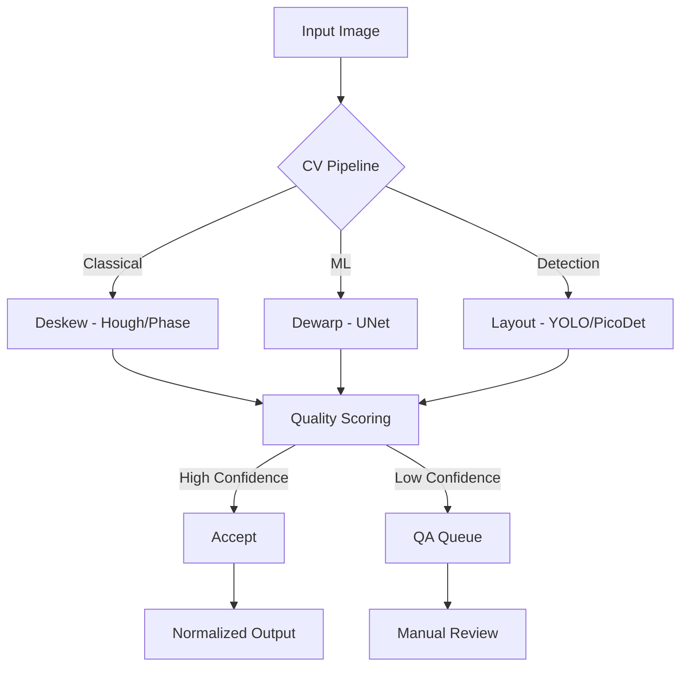
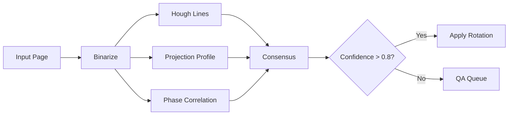
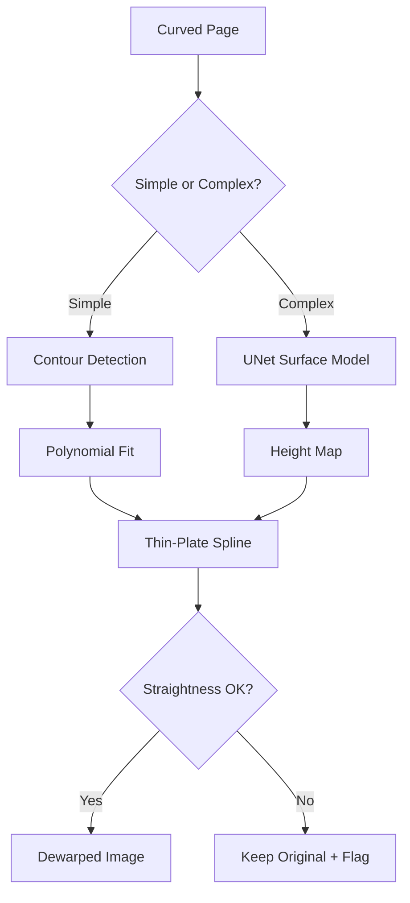
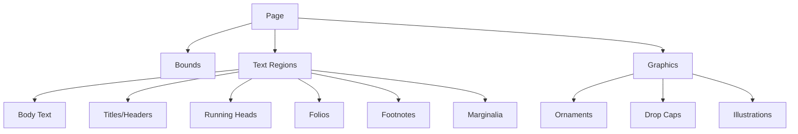
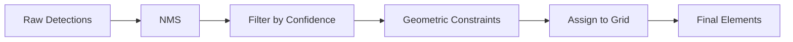
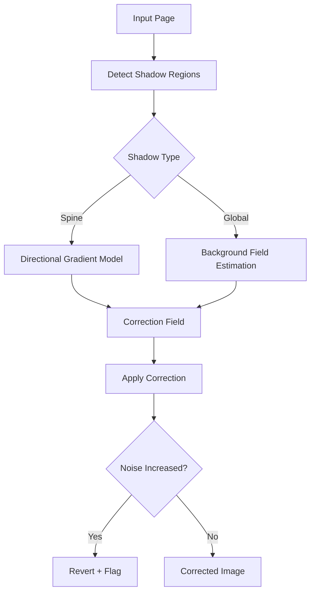
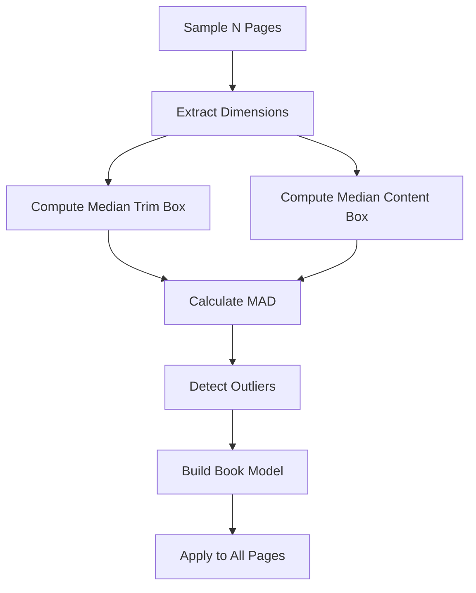
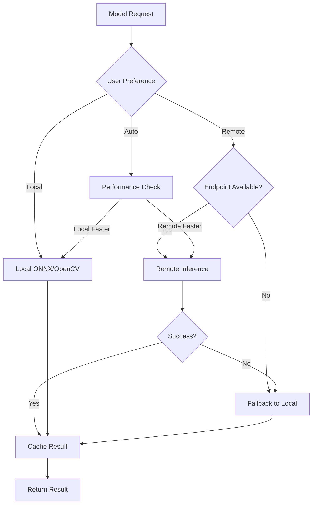
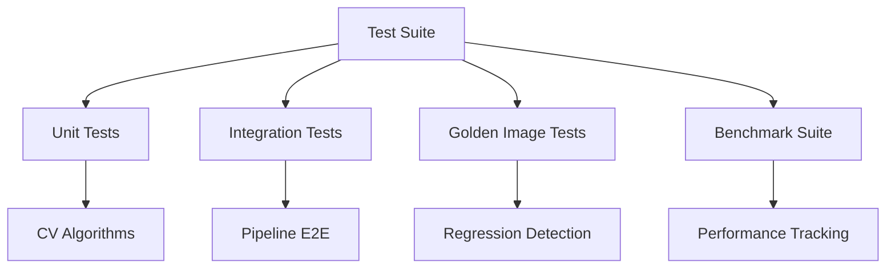
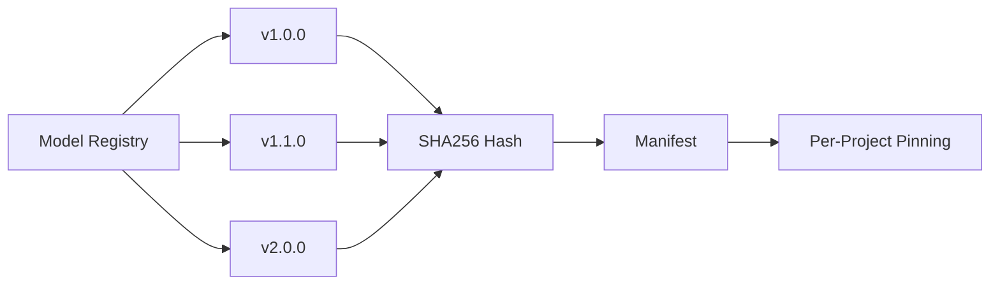

# Asteria Studio — Model & CV Strategy

## Goals

1. High-quality deskew/dewarp and layout detection with confidence scoring
2. Operate offline by default; allow optional remote inference with automatic fallback
3. Deterministic, debuggable outputs with measurable quality metrics
4. Graceful degradation on CPU-only systems; GPU acceleration when available



## Implementation Status

### Current (✅)

- ✅ **TypeScript normalization**: Scale, crop, metrics, preview generation
- ✅ **Sharp library**: Image manipulation (resize, format, metadata)
- ✅ **Book priors**: Median trim/content box derivation from samples
- ✅ **Spread split detection**: Center gutter analysis with confidence gating
- ✅ **Quality metrics**: Sharpness (Laplacian), contrast (stddev), basic implementation
- ✅ **Native utilities**: Projection profiles, Sobel magnitude, dHash via N-API for performance
- ✅ **Native layout heuristics**: Layout element detection from grayscale signals

### In Progress (🚧)

- 🚧 **Rust N-API bindings**: Scaffolded in `packages/pipeline-core`
- 🚧 **OpenCV integration**: Planned for classical CV methods
- 🚧 **ONNX Runtime**: Planned for ML models
- 🚧 **Remote layout inference**: HTTP endpoint scaffolding + auth/timeout hooks

### Planned (🎯)

- 🎯 **Deskew algorithms**: Hough, projection, phase correlation
- 🎯 **Dewarp models**: UNet surface estimation, thin-plate spline
- 🎯 **Layout detection**: YOLOv8n/PP-PicoDet fine-tuned on printed pages
- 🎯 **OCR assist**: Tesseract/ONNX textline detector
- 🎯 **Shading correction**: Spine shadow, illumination field estimation

## Deskew (Planned)

**Objective**: Detect page rotation angle and correct to upright orientation

### Deskew Methods



1. **Hough Line Aggregation**: Detect dominant line angles from text baselines
2. **Projection Profiles**: Histogram peaks in horizontal/vertical projections
3. **Phase Correlation**: Frequency-domain rotation detection on binarized masks

### Quality Targets

- **Angle Error**: ±0.3° (mean absolute error)
- **Consensus**: Multiple estimators agree within threshold
- **Outlier Rejection**: Discard extreme angles (>15°)

### Deskew Outputs

```rust
pub struct DeskewResult {
    skew_angle: f32,        // Detected angle in degrees
    confidence: f32,        // 0.0-1.0 consensus score
    method: String,         // "hough" | "projection" | "phase"
    rotated_image: Buffer,  // Corrected image
}
```

### Deskew Status

🎯 **Planned** — Rust implementation pending; N-API bindings scaffolded

## Dewarp (Planned)

**Objective**: Correct page curvature from book binding or scanning artifacts

### Dewarp Methods



1. **Page Contour Detection**: For simple cylindrical warps
   - Detect page edges with Canny + Hough
   - Fit polynomial curve to vertical edges
   - Compute warp field from curvature

2. **UNet Surface Estimation**: For complex 3D warps
   - Input: Grayscale page image
   - Output: Per-pixel height/normal map
   - Model: Lightweight UNet (5-10M params)
   - Training: Synthetic warped pages + real samples

3. **Thin-Plate Spline Warp**: Transform from distorted → flat
   - Control points from detected grid or learned surface
   - Smooth interpolation to avoid artifacts

### Fallbacks

- **Low Confidence** (< 0.7): Keep original, mark for QA
- **Excessive Warp**: Reject if residual error > threshold
- **Text Baseline Check**: Validate straightness after correction

### Dewarp Metrics

- **Straightness Error**: σ of text baseline deviations
- **Residual Warp Score**: MSE between corrected and ideal grid
- **Processing Time**: Target <500ms per page on CPU

### Dewarp Outputs

```rust
pub struct DewarpResult {
    confidence: f32,           // 0.0-1.0 warp correction quality
    warp_method: String,       // "contour" | "unet" | "none"
    dewarped_image: Buffer,    // Corrected image
    baseline_straightness: f32, // Lower is better
    surface_map: Option<Vec<f32>>, // Height map (optional)
}
```

### Dewarp Status

🎯 **Planned** — Rust + OpenCV implementation; UNet model training pending

## Layout & Element Detection (Planned)

**Objective**: Identify and classify page elements with bounding boxes and confidence scores

### Element Taxonomy



**Elements**:

1. **Page Bounds**: Outer edges excluding bleed
2. **Text Blocks**: Paragraphs, columns
3. **Titles/Headers**: Chapter openings, section titles
4. **Running Heads**: Repeated headers/footers
5. **Folios**: Page numbers
6. **Ornaments/Decorators**: Flourishes, borders, decorative elements
7. **Drop Caps**: Enlarged initial letters
8. **Footnotes**: Bottom-page annotations
9. **Marginalia**: Side notes, glosses

### Detection Models

**Primary Detector**: YOLOv8n or PP-PicoDet

- **Size**: 3-5M params (lightweight for CPU)
- **Input**: 640×640 or 800×800 crop
- **Output**: [class, x, y, w, h, confidence] per element
- **Classes**: 10-15 categories (page, title, folio, ornament, etc.)

**Training Strategy**:

1. **Synthetic Data**: Generate layouts from templates
2. **Real Samples**: Annotate 500-1000 pages from diverse corpora
3. **Augmentation**: Rotate, scale, noise, blur, shadow
4. **Fine-tuning**: Start from COCO pretrained weights

**OCR Assist** (Optional):

- **Tesseract/ONNX**: Textline detector for region refinement
- **Language Model**: Classify title vs body via n-grams (future)

### Post-Processing



1. **Non-Maximum Suppression**: Remove duplicate boxes (IoU threshold 0.5)
2. **Confidence Filtering**: Discard below threshold (default: 0.6)
3. **Geometric Constraints**:
   - Folios near margins
   - Running heads at top/bottom
   - Drop caps at paragraph starts
4. **Baseline Grid Alignment**: Snap to book priors when available

### Confidence Scoring

Per-element score based on:

- **Model output**: Raw detector confidence
- **Consistency**: Agreement with book priors
- **Context**: Spatial relationships (folios opposite pages, etc.)
- **Ensemble**: Local + remote model consensus (future)

### Layout Detection Outputs

```rust
pub struct LayoutElement {
    element_type: String,      // "title" | "folio" | "ornament" | ...
    bbox: [f32; 4],            // [x, y, w, h] in pixels
    confidence: f32,           // 0.0-1.0
    page_region: String,       // "header" | "body" | "footer" | "margin"
    text_content: Option<String>, // OCR result if available
}

pub struct LayoutDetectionResult {
    page_bounds: [f32; 4],
    elements: Vec<LayoutElement>,
    grid_confidence: f32,
    detection_time_ms: u64,
}
```

### Layout Detection Status

🎯 **Planned** — Model selection, dataset curation, training pipeline pending

### Training Signals from Review

Reviewer adjustments are captured as structured training signals to bootstrap future model
iterations. When a review is submitted, the system writes:

- **Sidecar adjustments**: per-page `adjustments` with rotation deltas, crop offsets, and element
  edit diffs (when present).
- **Training manifests**: JSON signals under
  `pipeline-results/runs/{runId}/training/`, including a `manifest.json` index plus one file per
  reviewed page.

These signals become the labeled deltas for supervised training (e.g., deskew/rotation correction,
crop refinement, and element bounding box updates). They can be aggregated to build curated
datasets and to score model drift over time.

## Spread Split (Implemented)

**Objective**: Detect two-page scans and split at gutter when confidence is high

### Spread Split Implementation

✅ **Algorithm** (in [pipeline-runner.ts](../apps/asteria-desktop/src/main/pipeline-runner.ts)):

1. **Aspect Ratio Check**: Skip if width/height < 1.25
2. **Center Band Analysis**:
   - Resize to 320px width for speed
   - Compute column-wise mean intensity
   - Detect low-intensity valley in center 40-60% region
3. **Confidence Scoring**:
   - Valley depth vs global mean
   - Valley width (gutter should be narrow)
   - Symmetry check (left/right sides similar brightness)
4. **Gating**: Split only if confidence > threshold (default: 0.7)

### Spread Split Outputs

````typescript
interface SpreadSplitResult {
  shouldSplit: boolean;
  confidence: number;
  gutterStart?: number; // Pixel position (in preview space)
  gutterEnd?: number;
  gutterStartRatio?: number; // Ratio (0.0-1.0) for original image
  gutterEndRatio?: number;
  width?: number;
  height?: number;
}
### Page ID Handling

When split is triggered:

- Original: `page-042.jpg`
- Left page: `page-042_L.jpg` (checksum preserved)
- Right page: `page-042_R.jpg` (checksum preserved)

### Spread Split Status

✅ **Implemented** — Detection logic complete; needs wiring to pipeline output stage

## Normalization & Scaling (Implemented)

**Objective**: Transform pages to consistent dimensions and DPI

### Normalization Implementation

✅ **Process** (in [normalization.ts](../apps/asteria-desktop/src/main/normalization.ts)):

```mermaid
flowchart LR
    A[Input Page] --> B[Read Metadata]
    B --> C[Compute Scale Factor]
    C --> D[Apply Scaling]
    D --> E[Crop with Bleed/Trim]
    E --> F[Quality Metrics]
    F --> G[Generate Preview]
    G --> H[Create Overlay]
    H --> I[Normalized Output]
````

1. **Input**: User-provided dimensions (mm/cm/inches) + target DPI
2. **Compute Target**:

   ```typescript
   targetWidthPx = (widthMm / 25.4) * targetDPI;
   targetHeightPx = (heightMm / 25.4) * targetDPI;
   ```

3. **Scale Factor**:

   ```typescript
   scale = min(targetWidth / inputWidth, targetHeight / inputHeight);
   ```

4. **Resize**: Sharp library with Lanczos3 filter (high quality)
5. **Crop**: Center-crop to exact target dimensions
6. **Color Normalization**: Optional white balance, contrast (conservative defaults)

### Bleed/Trim Rules

- **Bleed**: Extra space beyond trim edge (default: 3mm)
- **Trim**: Final page edge after cutting
- **Safe Zone**: Content area excluding bleed (default: 5mm inset)

**Current Status**: Bleed/trim detection falls back to defaults (JPEG SOF parsing fragile)

### Quality Metrics

✅ **Implemented**:

- **Sharpness**: Laplacian variance (higher = sharper)
- **Contrast**: Standard deviation of pixel intensities
- **Aspect Ratio**: Original vs target ratio difference
- **File Size**: Compressed output size

### Baseline Grid Alignment (Planned)

When book priors available:

- Detect text baseline spacing (median line height)
- Snap crop boundaries to align baselines across pages
- Preserve vertical rhythm for consistent typography

### Normalization Outputs

```typescript
interface NormalizationResult {
  outputPath: string;
  width: number;
  height: number;
  sharpness: number;
  contrast: number;
  aspectRatio: number;
  fileSize: number;
  previewPath?: string;
  overlayPath?: string;
}
```

### Normalization Status

✅ **Implemented** — TypeScript + Sharp; Rust optimization planned for performance

## Illumination & Shading Correction (Planned)

**Objective**: Remove lighting artifacts, spine shadows, and uneven illumination

### Shading Methods



1. **Low-Frequency Background Field**:
   - Sample border pixels (assumed to be white/light)
   - Fit polynomial surface (2D regression)
   - Subtract background to normalize illumination

2. **Spine Shadow Models**:
   - **Directional Gradient**: Detect dark bands near binding
   - **Band Detection**: Low-intensity vertical strips in center
   - **Confidence Scoring**: Validate via symmetry and width

3. **Guardrails**:
   - Measure noise before/after (stddev of high-frequency components)
   - Revert if residual noise > threshold (±10%)
   - Route to QA queue for manual review

### Shading Metrics

- **Shadow Intensity**: Mean darkness of detected shadow region
- **Correction Strength**: Max change in pixel values
- **Residual Noise**: High-pass filter variance
- **Confidence**: Overall correction quality (0.0-1.0)

### Shading Correction Outputs

```rust
pub struct ShadingCorrectionResult {
    corrected_image: Buffer,
    method: String,              // "background" | "spine" | "none"
    confidence: f32,
    shadow_intensity: f32,
    correction_strength: f32,
    residual_noise: f32,
}
```

### Shading Correction Status

🎯 **Planned** — Algorithm design complete; implementation in Rust pending

## Book Priors (Implemented)

**Objective**: Derive consistent geometry from sample pages and apply to full corpus

### Book Priors Implementation

✅ **Algorithm** (in [book-priors.ts](../apps/asteria-desktop/src/main/book-priors.ts)):



**Process**:

1. **Sampling**: First N pages (default: 50) or configurable ratio
2. **Extract Dimensions**: Width, height, aspect ratio per page
3. **Median Calculation**:
   - Trim box: Outer page bounds (median of all samples)
   - Content box: Inner text area (median of detected regions)
4. **Outlier Detection**:
   - MAD (Median Absolute Deviation) for each dimension
   - Flag pages > 3 MAD from median
5. **Model Storage**: Persist in manifest for reproducibility

### Book Model Structure

```typescript
interface BookModel {
  trimBoxPx?: {
    median?: [number, number, number, number]; // [x, y, w, h]
    dispersion?: [number, number, number, number]; // MAD per dimension
  };
  contentBoxPx?: {
    median?: [number, number, number, number];
    dispersion?: [number, number, number, number];
  };
  runningHeadTemplates?: RunningHeadTemplate[]; // Planned
  folioModel?: FolioModel; // Planned
  ornamentLibrary?: OrnamentAnchor[]; // Planned
  baselineGrid?: BaselineGridModel; // Planned
}
```

### Application

**Pass A** (Sampling): Derive priors from first N pages
**Pass B** (Application):

- Snap crops to median trim box within drift bounds
- Flag anomalies (outliers) for manual review
- Ensure consistent geometry across corpus

### Determinism

✅ **Manifest Storage**:

- Priors saved in `manifest.json`
- Reused for later batches of same corpus
- Versioned with config hash for reproducibility

### Book Priors Status

✅ **Implemented** — TypeScript version complete; Rust port planned for performance

## Remote vs Local Execution (Planned)

**Objective**: Allow optional remote inference with automatic fallback to local processing



### Configuration

**Per-model settings**:

```yaml
models:
  deskew:
    mode: local # local | remote | auto
    local_backend: opencv
    remote_endpoint: null

  layout_detection:
    mode: auto
    local_backend: onnx
    local_model: yolov8n-pages.onnx
    remote_endpoint: "https://api.example.com/detect"
    timeout_ms: 5000
```

### Backends

**Local Defaults** (Shipped with app):

- **OpenCV**: Classical CV methods (deskew, dewarp, edge detection)
- **ONNX Runtime**: Lightweight ML models (YOLOv8n, UNet)
- **Tesseract**: OCR for text region refinement

**Remote Option** (User-configured):

- **HTTP Endpoint**: Triton, TorchServe, or custom API
- **Protocols**: REST (JSON), gRPC (future)
- **Auth**: API key, OAuth2 (future)

### Environment Variables (Scaffolded)

- `ASTERIA_REMOTE_LAYOUT_ENDPOINT` — HTTP endpoint for layout detection
- `ASTERIA_REMOTE_LAYOUT_TOKEN` — Optional bearer token
- `ASTERIA_REMOTE_LAYOUT_TIMEOUT_MS` — Request timeout (default 5000)

### Pipeline Config Keys (Scaffolded)

- `models.endpoints.remote_layout_endpoint`
- `models.endpoints.remote_layout_token_env`
- `models.endpoints.remote_layout_timeout_ms`

### Fallback Strategy

1. **Network Check**: Ping endpoint before first request
2. **Timeout**: Cancel if response > threshold (default: 5s)
3. **Error Handling**:
   - Connection refused → Local
   - 5xx errors → Retry once, then local
   - Rate limit → Exponential backoff
4. **Cache**: Store remote results locally to avoid re-inference
5. **Log**: Record fallback events for user visibility

### Performance Comparison

| Stage            | Local (CPU) | Local (GPU) | Remote (Hypothetical) |
| ---------------- | ----------- | ----------- | --------------------- |
| Deskew           | 50-100ms    | 20-30ms     | 100-200ms (network)   |
| Dewarp           | 200-500ms   | 50-100ms    | 300-600ms (network)   |
| Layout Detection | 500-1000ms  | 100-200ms   | 400-800ms (network)   |

**Decision Logic** (Auto mode):

- If GPU available → Local GPU
- Else if remote < 2× local CPU → Remote
- Else → Local CPU

### Remote vs Local Status

🚧 **In Progress** — Remote layout inference scaffolded with HTTP endpoint support

## Evaluation

### Testing Strategy



### Current Testing (✅)

**Unit & Integration** (Vitest):

- ✅ 190 tests across 31 files
- ✅ ~92% code coverage
- ✅ Corpus scanner, analyzer, normalization, book priors
- ✅ IPC contracts and validation
- ✅ Pipeline runner with recovery

**Categories**:

1. **IPC Layer**: Channel validation, type safety
2. **Corpus Operations**: Scanning, checksums, duplicate detection
3. **Analysis**: Dimension calculation, target resolution
4. **Normalization**: Scale/crop logic, metrics, previews
5. **Book Priors**: Median computation, outlier detection
6. **Pipeline**: End-to-end flow, checkpoint recovery

### Planned Testing (🎯)

**Golden Image Tests**:

- Frozen input pages with expected outputs
- Pixel-level diff checks for crops, angles
- JSON schema validation for layout metadata
- CI/CD regression detection

**Datasets**:

- **Per-project labeled subsets**: 100-200 pages with ground truth
- **Synthetic warped pages**: Procedurally generated test cases
- **Diverse corpora**: Varied fonts, layouts, scan quality

**Metrics**:

- **Deskew MAE**: Mean absolute error in degrees
- **Warp Straightness**: Text baseline variance (lower is better)
- **Element IoU**: Intersection-over-union for bounding boxes
- **F1 Score**: Precision/recall for title/folio detection
- **Latency**: Per-stage processing time (ms/page)

### Benchmark Suite (Planned)

**Hardware Profiles**:

- **CPU-only**: Intel i5/i7, Apple M1/M2
- **GPU**: NVIDIA RTX 3060, Apple Metal
- **Memory**: 8GB, 16GB, 32GB configurations

**Workloads**:

- Small corpus: 50 pages
- Medium corpus: 300 pages
- Large corpus: 1000+ pages

**Tracked Metrics**:

- Throughput (pages/sec)
- Memory usage (peak/average)
- GPU utilization (when available)
- Energy consumption (macOS only)

### Continuous Integration

**Automated Checks** (Current):

- ✅ TypeScript compilation
- ✅ ESLint (code quality)
- ✅ Unit test suite (190 tests)
- ✅ Coverage thresholds (80/80/75/80)

**Planned**:

- 🎯 E2E tests (Playwright)
- 🎯 Golden image regression
- 🎯 Performance benchmarks
- 🎯 Security audits (Dependabot, npm audit)

## Model Packaging & Updates

### Versioning Strategy



**Storage Layout**:

```text
models/
├── deskew/
│   ├── v1.0.0/
│   │   ├── model.onnx
│   │   ├── manifest.json   # Model metadata, SHA256
│   │   └── README.md
│   └── v1.1.0/
│       ├── model.onnx
│       └── manifest.json
├── layout_detection/
│   └── yolov8n-pages/
│       ├── v1.0.0/
│       │   ├── model.onnx
│       │   ├── classes.txt
│       │   └── manifest.json
│       └── v1.1.0/
└── dewarp/
    └── unet-surface/
        └── v1.0.0/
```

**Manifest Example**:

```json
{
  "name": "yolov8n-pages",
  "version": "1.0.0",
  "sha256": "a1b2c3d4...",
  "size_bytes": 4285132,
  "architecture": "YOLOv8n",
  "input_size": [640, 640],
  "classes": ["page", "title", "folio", "ornament", ...],
  "trained_on": "synthetic-pages-v2 + real-samples-500",
  "metrics": {
    "mAP50": 0.87,
    "mAP50-95": 0.64
  },
  "compatible_versions": ["0.1.0", "0.2.0"]
}
```

### Update Mechanism (Planned)

**Safe Rollbacks**:

- Per-project model pinning in config
- Manifest tracks model version used per run
- Downgrade option if new version causes issues

**Update Flow**:

1. Check for new model versions (manual or auto-check)
2. Download to staging directory
3. Verify SHA256 checksum
4. Run validation tests on sample pages
5. Promote to active if tests pass
6. Keep previous version for rollback

**Hardware Detection**:

- Detect CPU features (AVX2, AVX512)
- Detect GPU (CUDA, Metal, ROCm)
- Select optimized ONNX runtime build
- Use quantized models on CPU-only systems

### Distribution (Future)

**Bundled with App**:

- Basic ONNX models (<10MB each)
- Tesseract language data (English + common)
- OpenCV binaries for platform

**Optional Downloads**:

- Large models (>50MB) for advanced features
- Additional language packs
- Specialized detectors (illuminated manuscripts, etc.)

**Update Channels**:

- **Stable**: Tested on diverse corpora, quarterly releases
- **Beta**: Early access, monthly updates
- **Nightly**: Experimental, for developers

### Distribution Status

🎯 **Planned** — Directory structure defined; update mechanism pending
