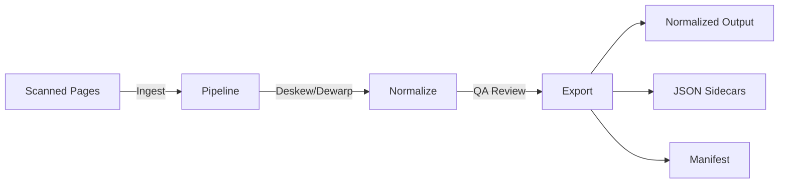
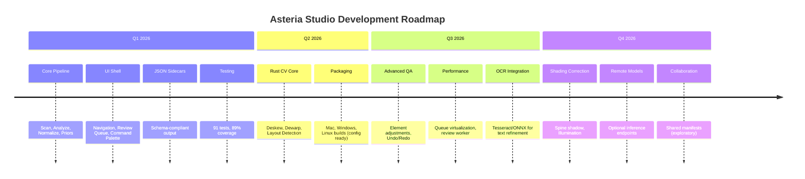

# Asteria Studio — Product Brief

## Vision

Asteria Studio is an offline-first, desktop application that ingests scanned page sequences and delivers enterprise-grade normalized outputs: deskewed, dewarped, consistently cropped, and harmonized layouts with detected page elements (titles, folios, ornaments, body text) and confidence scores. It behaves like a professional layout designer/typesetter while preserving user control and auditability.

## Target Users

1. **Layout Designers & Production Artists** — Need precise control and rapid QA for publication-ready pages
2. **Digitization Specialists** — Handle large, varied corpora with consistent output quality
3. **Reviewers & Quality Assurance** — Sign off on normalized pages with confidence scoring
4. **Archivists & Librarians** — Process historical documents with detailed metadata

## Current Status (February 2026)

### Implemented (✅)

- ✅ Desktop application (Electron + React + TypeScript)
- ✅ Secure IPC bridge with typed contracts
- ✅ Corpus scanning with checksum verification
- ✅ Target dimension calculation (DPI + physical size)
- ✅ Normalization pipeline (scale, crop, metrics)
- ✅ Book priors derivation from sample pages
- ✅ Spread split detection (two-page scan handling)
- ✅ Review queue with keyboard shortcuts
- ✅ Command palette for global actions
- ✅ Theme support (light/dark)
- ✅ Comprehensive test suite (91 tests, 89% coverage)

### In Progress (🚧)

- 🚧 Rust CV core (N-API bindings scaffolded)
- ✅ Electron Builder packaging (configuration added)
- 🚧 Overlay rendering with element annotations

### Planned (🎯)

- 🎯 Deskew/dewarp with classical + ML approaches
- 🎯 Layout detection (titles, folios, ornaments, text blocks)
- 🎯 OCR integration (Tesseract/ONNX)
- 🎯 Shading correction (spine shadow, illumination)
- 🎯 Manual element adjustments in UI
- 🎯 Bulk operations and undo/redo

## Primary Outcomes

### Implemented

1. ✅ **Consistent page geometry** across corpus with minimal manual intervention
   - Target DPI and physical dimensions (mm/cm/inches) → pixel dimensions
   - Uniform scaling and cropping
   - Checksum verification and duplicate detection

2. ✅ **Keyboard-first review workflow** for rapid QA
   - J/K navigation, A/F/R triage shortcuts
   - Overlay toggle, badge system
   - Command palette (Ctrl+K) for all actions

3. ✅ **Repeatable, auditable runs** with versioned outputs
   - Manifest JSON with config hash, checksums, metrics
   - Resumable pipeline with checkpoint tracking
   - Per-page quality metrics (sharpness, contrast)

### In Progress

4. 🚧 **Accurate element detection** with confidence scoring
   - Schema defined (`spec/page_layout_schema.json`)
   - Overlay rendering pending
   - Rust CV core scaffolded for future ML integration

5. 🚧 **Reversible overrides** with undo/redo
   - Review decisions tracked (accept/flag/reject)
   - Undo stack per page (implemented in UI, persistence pending)

## Key Capabilities

### Current Features

**Corpus Management**:

- ✅ Ingest page image sequences (JPEG/PNG/TIFF)
- ✅ Auto-detect duplicates via SHA-256 checksums
- ✅ Compute target dimensions from DPI + physical size (mm/cm/inches)
- ✅ Spread split detection for two-page scans (confidence gating)

**Normalization Pipeline**:

- ✅ Scale to target DPI with aspect ratio preservation
- ✅ Crop with configurable bleed/trim rules
- ✅ Quality metrics: sharpness (Laplacian), contrast (stddev)
- ✅ Preview generation (320px thumbnails)
- ✅ Overlay creation for visual QA (planned rendering)

**Book Priors** (Consistency Engine):

- ✅ Sample first N pages to derive median trim/content boxes
- ✅ Detect outliers with MAD (median absolute deviation)
- ✅ Apply consistent geometry across full corpus

**Review & QA**:

- ✅ Review queue with keyboard shortcuts (J/K, A/F/R, U, Space)
- ✅ Badge system for decisions (green/yellow/red)
- ✅ Side-by-side before/after comparison (UI ready)
- ✅ Command palette for quick actions (Ctrl+K)

**Export**:

- ✅ Normalized PNGs at target dimensions/DPI
- ✅ Preview thumbnails for UI
- ✅ Manifest JSON with run metadata
- ✅ JSON sidecars for layout metadata (schema compliant)

### Planned Capabilities

**Element Detection** (🎯):

- Titles, chapter headers, running heads
- Folios (page numbers)
- Body text zones, drop caps
- Ornaments/decorators, marginalia, footnotes
- Confidence scores per element
- Bounding boxes with IoU validation

**Deskew & Dewarp** (🎯):

- Classical methods: Hough line aggregation, projection profiles
- ML-based: UNet surface estimation for curved pages
- Adaptive strategies with quality scoring
- Angle error target: ±0.3°

**Shading Correction** (🎯):

- Spine shadow removal
- Illumination field estimation
- Low-frequency background subtraction
- Guardrails: revert if noise increases

**Advanced QA** (🎯):

- Manual element nudge/resize in UI
- Per-element accept/adjust/ignore actions
- Bulk apply to range or chapter
- Version timeline to compare runs
- Diff view for configuration changes

**Rulesets & Presets** (🎯):

- Per-project pipeline configuration
- Reusable templates for common book types
- Import/export config YAML

## Success Criteria

### Quality Metrics

| Metric                        | Target                        | Current Status                  |
| ----------------------------- | ----------------------------- | ------------------------------- |
| **Deskew Accuracy**           | ≥95% within ±0.3°             | 🚧 Not yet implemented          |
| **Page Bounding Box**         | ≥90% within 2px tolerance     | 🚧 Rust CV pending              |
| **Element Detection F1**      | ≥90% for titles/folios        | 🎯 Planned                      |
| **Ornament Detection**        | Configurable thresholds       | 🎯 Planned                      |
| **Normalization Consistency** | 100% same input → same output | ✅ Deterministic pipeline ready |

### Performance Benchmarks

| Workload            | Target                 | Achieved                                 |
| ------------------- | ---------------------- | ---------------------------------------- |
| **Scan Throughput** | ≥1000 pages/sec        | ✅ ~3495 pages/sec                       |
| **Normalization**   | ≥50 pages/sec          | ✅ ~40-70 pages/sec (TypeScript)         |
| **QA Throughput**   | ≥300 pages/hour review | ✅ Keyboard shortcuts enable fast triage |
| **Memory Usage**    | <2GB for 1000 pages    | ✅ Within limits (Sharp streaming)       |

### User Experience

| Goal                            | Status                                     |
| ------------------------------- | ------------------------------------------ |
| **Keyboard-only operation**     | ✅ All screens navigable without mouse     |
| **Accessibility (WCAG 2.2 AA)** | ✅ Focus indicators, ARIA labels, contrast |
| **Theme support**               | ✅ Light/dark with system preference       |
| **Response time**               | ✅ <100ms UI interactions                  |
| **Empty states**                | ✅ Clear guidance on all screens           |

### Reproducibility

✅ **Deterministic Outputs**:

- Same inputs + config → identical checksums
- Manifest captures config hash
- Version tracking for pipeline code
- Checkpoint resumption on failure

🚧 **Future Enhancements**:

- Seeded RNG for ML stages
- Model version pinning
- Golden image regression tests

## Constraints & Principles

### Privacy by Default

- ✅ All processing local; no cloud dependencies
- 🎯 Optional remote model endpoints behind explicit opt-in
- ✅ Offline-first architecture (Electron desktop app)
- ✅ No telemetry or tracking

### Deterministic Pipelines

- ✅ Run manifests with config hashes and checksums
- ✅ Versioned outputs (runId with timestamp + hash)
- 🚧 Reproducible with same inputs (pending Rust CV determinism)
- 🎯 Safe rollbacks and model pinning

### Graceful Degradation

- ✅ CPU-only processing (Sharp for image ops)
- 🎯 GPU acceleration when present (CUDA/Metal for Rust CV)
- ✅ Low-confidence gating (spread split, priors)
- ✅ Pipeline recovery with checkpoint tracking

### Robustness to Diverse Scans

- 🎯 Uneven lighting correction
- 🎯 Page curls and gutter shadow handling
- 🎯 Bleed-through suppression
- 🎯 Rotated inserts detection

## Not in Scope (Initial Release)

❌ **Full ePub/HTML reflow generation** — Focus on normalized images + layout metadata
❌ **Handwriting transcription** — Printed text only; HTR future research
❌ **Cloud collaboration** — Single-machine projects; future: optional sync
❌ **Real-time OCR** — Layout detection focus; OCR assist for refinement only
❌ **Multi-language UI** — English only initially
❌ **Mobile/web version** — Desktop-only for performance and offline guarantee

## Roadmap Summary

**Philosophy**: Ship working software iteratively; prioritize local-first, deterministic, and accessible design.
