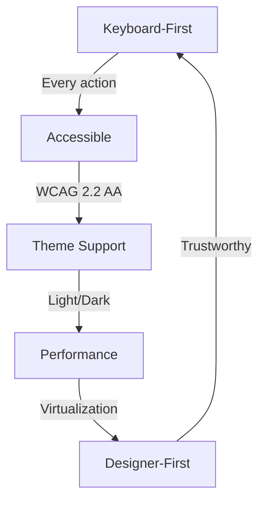
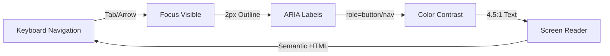

# Asteria Studio — UI/UX

## Design Principles



1. **Keyboard-First**: Every action accessible without mouse; global shortcuts
2. **Designer-First**: Accurate, responsive, with trustworthy overlays and metrics
3. **Low-Friction QA**: Minimal clicks to approve/reject/fix elements; bulk operations
4. **Accessibility**: WCAG 2.2 Level AA compliance; screen reader support
5. **Offline Clarity**: Explicit indicators for local vs remote model use (future)
6. **Performance**: Fast response, virtualized lists, progressive loading

## Core Screens (Implemented)

### 1. Navigation

**Layout**: Left sidebar with icon + label buttons
**Keyboard**: `Ctrl+1` through `Ctrl+6` for direct navigation

```text
┌─────────────────────┬─────────────────────────┐
│  ☰ Navigation       │  Main Content Area      │
│  ├─ 📁 Projects     │                         │
│  ├─ ⏱️ Runs         │  [Active Screen]        │
│  ├─ 📊 Monitor      │                         │
│  ├─ ✓ Review        │                         │
│  ├─ 📤 Exports      │                         │
│  └─ ⚙️ Settings     │                         │
└─────────────────────┴─────────────────────────┘
```

**Features**:

- Active screen highlighted with accent color
- Focus indicators (2px outline)
- Tooltip on hover with keyboard shortcut
- Semantic HTML (`<nav>`, `role="navigation"`)

### 2. Command Palette

**Trigger**: `Ctrl+K` (Cmd+K on Mac)
│ > Go to Run History Ctrl+2 │
│ > Start New Run │
└────────────────────────────────────────┘
`A` — Accept current page (green badge)
`F` — Flag for review (yellow badge)
`R` — Reject current page (red badge)
`U` — Undo last decision
`Space` — Toggle overlay visibility
`Z` — Zoom in/out (planned)
`Ctrl+Enter` — Submit review decisions

- Type to filter commands
- Categories grouped visually

**Purpose**: Choose project, show metadata, initiate imports

```text
┌────────────────────────────────────────┐
│  mind-myth-and-magick                  │
│  [Open Project]               [⋮]      │
├────────────────────────────────────────┤
│  (Empty state)                         │
│  Drop project folder or click Import  │
└────────────────────────────────────────┘
```

**Features** (Planned):

- Recent projects list
- Metadata: page count, size, last modified
- Hardware status (GPU/CPU detected)
- Model mode toggle (local/remote/auto)

### 4. Run History (Implemented)

**Purpose**: Browse past runs, select a run for review, and inspect its config snapshot.

**Current capabilities**:

- List runs with review queue counts
- Select a run and open Review Queue
- View per-run config snapshot (read-only)

### 5. Review Queue

**Purpose**: Triage pages with confidence scores; keyboard-first navigation

```text
┌────────────────────────────────────────┐
│  Review Queue          Filter: [All ▼] │
├────────────────────────────────────────┤
│  [←] Page 42 of 300               [→] │
│                                        │
│  ┌──────────┬──────────┐              │
│  │ Normalized│ Source  │              │
│  │   [img]  │ [img]*   │              │
│  └──────────┴──────────┘              │
│                                        │
│  [Toggle Overlay] [Zoom] [Compare]     │
│                                        │
│  [A] Accept  [F] Flag  [R] Reject    │
└────────────────────────────────────────┘
```

**Keyboard Shortcuts** (Implemented):

- `J` / `K` — Navigate to next/previous page
- `A` — Accept current page (green badge)
- `F` — Flag for review (yellow badge)
- `R` — Reject (red badge)
- `U` — Undo last decision
- `Space` — Toggle overlay visibility
- `Ctrl+Enter` — Submit review decisions
- `+` / `-` — Zoom in/out
- `0` — Reset zoom
- `Shift + Arrows` — Pan
- `[` / `]` — Rotate counterclockwise/clockwise
- `Alt + [` / `Alt + ]` — Micro-rotate

**Visual Feedback**:

- Badge color: 🟢 Accepted, 🟡 Flagged, 🔴 Rejected
- Confidence label per page (sidebar)
- Overlay layers toggled via checkboxes (when sidecar data is available)
- Crop/trim handles appear on-canvas when adjustment mode is active
- Rotation tools show live degree offsets and snap-to-zero hinting

**Implementation note**:

- Compare view is shown when source previews are available.
- Overlay layers are driven by sidecar element data; if sidecar is missing, overlays are hidden.
- Adjustments are persisted via per-page overrides and reflected in sidecars/manifest entries.

**Data Source** (Implemented):

- Review queue items loaded via IPC (`asteria:fetch-review-queue`)
- Decisions submitted via IPC (`asteria:submit-review`)

**Performance Enhancements** (Implemented):

- Virtualized sidebar list for large queues (windowed rendering)
- Scroll sync with keyboard navigation for smooth selection updates
- Review queue sorting offloaded to a web worker

### 6. Run Monitor (Placeholder)

**Purpose**: Live progress of active pipeline run

```text
┌────────────────────────────────────────┐
│  Run Monitor                  [Pause] │
├────────────────────────────────────────┤
│  Normalizing: 142 / 300 pages         │
│  ████████░░░░░░░░░░░░░  47%          │
│                                        │
│  Current Stage: Normalization          │
│  ETA: 2m 15s                           │
│  Throughput: 3.2 pages/sec             │
│                                        │
│  [View Logs] [Cancel Run]              │
└────────────────────────────────────────┘
```

**Features** (Planned):

- Stage-level progress bars
- Real-time throughput
- Pause/resume/cancel controls
- Expandable log viewer
- Warnings/errors inline

### 7. Settings Screen (Partial)

**Purpose**: Configure pipeline defaults and per-project overrides (limited to key fields)

**Sections** (Current):

- **Pipeline**: Target DPI, target dimensions, spread split toggle, book priors sampling
- **QA thresholds**: Mask coverage minimum, semantic threshold (body)
- **Source info**: Config source path and project override path

**Planned**:

- Appearance, performance, keyboard customization, and model configuration

## Key Interactions

### Manual Dimension Entry (Planned)

**Dialog**: Accept mm/cm/inches with live preview

```text
┌─────────────────────────────────────┐
│  Set Target Dimensions              │
├─────────────────────────────────────┤
│  Width:  [210] [mm ▼]               │
│  Height: [297] [mm ▼]               │
│  DPI:    [300]                      │
│                                     │
│  Preview:                           │
│  Output Size: 1275 × 1650 px        │
│  Aspect Ratio: 0.7273 (A4)          │
│                                     │
│  [Cancel]              [Apply]      │
└─────────────────────────────────────┘
```

### Overlay System (Implemented)

**Layer Types**:

- **Crop bounds** (green) — Detected page edges
- **Trim box** (blue dashed) — Trim boundary after bleed
- **Text blocks** (amber) — Detected paragraphs
- **Titles / Running heads** (magenta) — Header cues
- **Folios** (cyan) — Page numbers
- **Ornaments** (violet) — Decorative elements

**Controls**:

- `Space` — Toggle all overlays
- Individual layer toggles in sidebar
- On-canvas handles for crop/trim nudging (snaps to book priors)

**Adjustment UX**:

- Toolbar provides rotation, micro-rotation, and reset controls (with live angle readout).
- Crop/trim buttons enable draggable handles on the preview for overlay editing.
- Apply override persists adjustments to the run’s override folder and metadata files.

### Bulk Operations (Planned)

**Apply adjustments to**:

- Current page only
- Selected range (e.g., pages 10-25)
- Entire chapter (detected via layout profile)
- All pages with similar confidence

**Actions**:

- Apply crop offset
- Adjust margin rules
- Apply rotation delta
- Accept/reject all flagged
- Bulk export

### Undo/Redo Stack (Planned)

- Per-page decision history
- Per-run configuration changes
- Version timeline to compare runs
- Persistent across sessions (stored in manifest)

## Keyboard Shortcuts

### Global Navigation

| Shortcut         | Action                  |
| ---------------- | ----------------------- |
| `Ctrl+K` (Cmd+K) | Open command palette    |
| `Ctrl+1`         | Go to Projects          |
| `Ctrl+2`         | Go to Run History       |
| `Ctrl+3`         | Go to Live Monitor      |
| `Ctrl+4`         | Go to Review Queue      |
| `Ctrl+5`         | Go to Exports           |
| `Ctrl+6`         | Go to Settings          |
| `Ctrl+,`         | Open Settings (planned) |

### Review Queue

| Shortcut  | Action                            |
| --------- | --------------------------------- |
| `J`       | Next page                         |
| `K`       | Previous page                     |
| `A`       | Accept current page (green badge) |
| `F`       | Flag for review (yellow badge)    |
| `R`       | Reject current page (red badge)   |
| `U`       | Undo last decision                |
| `Space`   | Toggle overlay visibility         |
| `Z`       | Zoom in/out                       |
| `[` / `]` | Rotate page                       |
| `Ctrl+B`  | Bulk apply to range (planned)     |

### General

| Shortcut       | Action                 |
| -------------- | ---------------------- |
| `Escape`       | Close dialog/palette   |
| `Tab`          | Focus next element     |
| `Shift+Tab`    | Focus previous element |
| `Enter`        | Confirm/execute        |
| `Ctrl+Z`       | Undo (planned)         |
| `Ctrl+Shift+Z` | Redo (planned)         |

**Accessibility**: All shortcuts displayed in tooltips and help menu. Customization planned for Settings screen.

## Status & Feedback

### Current Implementation

- **Theme indicator**: Light/dark mode toggle in navigation
- **Empty states**: Clear guidance for all screens (Projects, Review Queue)
- **Loading states**: Placeholder screens with consistent messaging

### Planned

- Remote/offline mode banners with fallback indicators
- Stage-level confidence/quality bars
- Warnings for risky operations (extreme warp, low confidence)
- Run summary dashboard with metrics, errors, and output files

## Accessibility & Responsiveness

### WCAG 2.2 Level AA Compliance



**Current Implementation**:

- ✅ **Keyboard-only operation**: All UI navigable without mouse
- ✅ **Focus indicators**: 2px outline on `:focus-visible`
- ✅ **Semantic HTML**: `<nav>`, `<button>`, `<main>` elements
- ✅ **ARIA labels**: Descriptive button names, navigation roles
- ✅ **Color contrast**: 4.5:1 for text, 3:1 for UI elements (tested)
- ✅ **Theme support**: Light/dark modes persist via localStorage

**Testing**:

- Testing Library queries use `getByRole` for accessibility validation
- Keyboard event simulation in unit tests
- Manual screen reader testing (planned)

**Responsive Layout**:

- Works on 13" laptops (1280×800 min) and large monitors
- Resizable panels with remembered state (planned)
- Font scaling support via CSS custom properties
- Sidebar collapses on narrow screens (planned)

## Design Tokens & Theming

**CSS Custom Properties** (implemented in `src/renderer/theme/tokens.ts`):

```css
:root {
  --color-bg-primary: #ffffff;
  --color-bg-secondary: #f5f5f5;
  --color-text-primary: #1a1a1a;
  --color-accent: #0066cc;
  --color-success: #22c55e;
  --color-warning: #f59e0b;
  --color-error: #ef4444;
  --spacing-xs: 4px;
  --spacing-sm: 8px;
  --spacing-md: 16px;
  --spacing-lg: 24px;
}

[data-theme="dark"] {
  --color-bg-primary: #1a1a1a;
  --color-bg-secondary: #2a2a2a;
  --color-text-primary: #f5f5f5;
}
```

**Benefits**:

- Consistent spacing and typography
- Easy theme switching (light/dark)
- System preference detection (`prefers-color-scheme`)
- Customizable via Settings (future)

## File Conventions in UI

### Project Tree Display (Planned)

```text
📁 mind-myth-and-magick/
├─ 📂 input/raw/
│  └─ 🖼️ Pages/ (783 files)
└─ 📂 pipeline-results/
   ├─ run-index.json
   └─ runs/
      └─ run-1704067200000/
         ├─ normalized/
         ├─ previews/
         ├─ overlays/
         ├─ sidecars/
         ├─ report.json
         ├─ review-queue.json
         └─ manifest.json
```

**Features**:

- Clickable links to JSON sidecars
- Open normalized image in system viewer
- File size and modification time
- Checksum verification status

## Empty States

Every screen includes clear guidance when no data is present:

```text
┌────────────────────────────────────┐
│                                    │
│         📁                         │
│  No projects found                 │
│                                    │
│  Drop a project folder here or     │
│  click Import to get started       │
│                                    │
│        [Import Corpus]             │
│                                    │
└────────────────────────────────────┘
```

**Implemented for**:

- Projects screen (no projects)
- Review queue (no pages)
- Command palette (no matching commands)

**Planned for**:

- Run history (no runs)
- Exports (no exports)
- Settings (default values)
